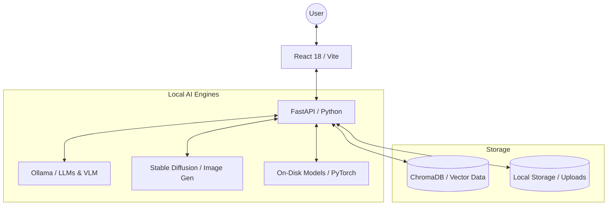

 # 🧠 Offline AI Digital Brain

> A **privacy-first**, **state-of-the-art** local AI ecosystem. Organize your knowledge, chat with specialized agents, and process visual data—all 100% offline.

<div align="center">


</div>

---

## ✨ Overview

The **Offline AI Digital Brain** is a comprehensive, locally-hosted platform that transforms your personal hardware into a powerful AI workstation. It combines multi-agent intelligence, document RAG (Retrieval-Augmented Generation), and multimodal processing into a single, unified interface.

### 🛡️ Why Local?
- **Zero Latency External dependecy** — No API keys, no internet required.
- **Absolute Privacy** — Your documents, chats, and images never leave your disk.
- **Eternal Ownership** — No subscription fees or "deprecating" models.

---

## 🚀 Key Features

### 🤖 Core Intelligence
- **Multi-Agent Chat**: specialized agents for Research, Analysis, Synthesis, and Coding.
- **Writing Assistant**: Local drafting, summarization, and tone shifting.
- **Gamified Learning**: Generate quizzes and simulations directly from your own knowledge base.

### 📚 Knowledge & Documents
- **Private RAG**: Semantic search across PDF, DOCX, and TXT files using ChromaDB.
- **Multimedia Indexing**: Index web pages via the companion browser extension.
- **Offline Translation**: Professional-grade translation across multiple languages.

### 👁️ Multimodal & Creative
- **VLM OCR**: Advanced OCR for handwritten and scanned docs using LLava 7B.
- **Stable Diffusion**: Text-to-image generation and background removal.
- **Web Creator**: Describe a website and watch it build in real-time.

---

## 📐 System Architecture



---

## 📂 Project Structure

Following a comprehensive cleanup, the workspace is now highly organized:

```
ai_brain-main/
├── src/                # Modern React frontend (TypeScript)
├── backend/            # FastAPI orchestration layer
│   └── tests/          # Consolidated backend verification suite
├── archived_docs/      # 📂 NEW: Project research, guides, and MD/PDF reports
├── tests/              # 📂 NEW: Root-level utility and integration tests
├── data/               # Persistent knowledge base storage
├── browser-extension/  # Web capture tool for Chrome/Edge
└── package.json        
```

---

## 🛠️ Quick Start

### 1. Prerequisites
- **Python 3.10+** & **Node.js 18+**
- **Ollama**: [Download here](https://ollama.com)
- **Required Models**:
  ```bash
  ollama pull tinyllama mistral llava nomic-embed-text
  ```

### 2. Startup Suite
We recommend running the backend and frontend in separate terminals:

**Terminal A: Backend**
```bash
cd backend
python -m venv venv
.venv\Scripts\activate  # Windows
pip install -r requirements.txt
python run.py
```

**Terminal B: Frontend**
```bash
npm install
npm run dev
```

---

## 🛡️ Privacy Guarantee

| Commitment | Status |
|---|---|
| No cloud inference | ✅ |
| No data collection | ✅ |
| No telemetry | ✅ |
| No external auth | ✅ |

---

<div align="center">
  <strong>Built for Privacy. Designed for Power. 🧠</strong><br/>
  MIT Licensed | © 2026 Offline AI Digital Brain Project
</div>
